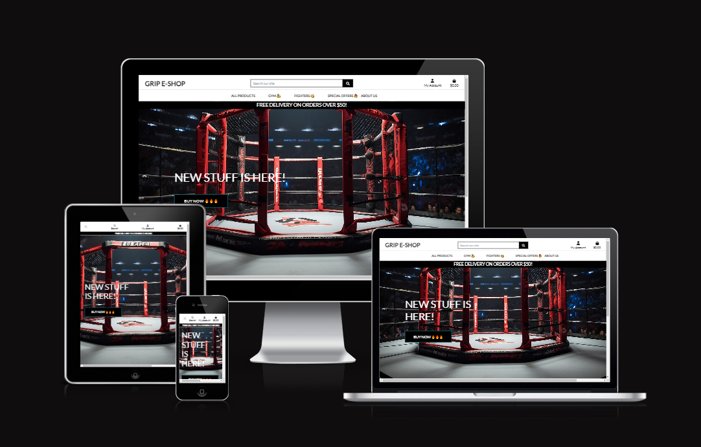
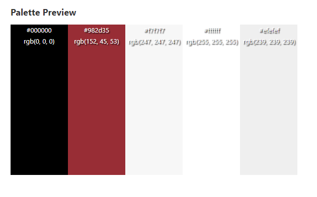

# GRIP E-SHOP

## E-commerce Store For Gym Enthusiasts
> Workout lovers e-commerce website that provides goods for sale as well as blog content to share tips and advice.

### - By Filip Svanda

## **[Live site](https://grip-e-shop-25bf5d916437.herokuapp.com/)  |  [Repository](https://github.com/RockyPraxe/GRIP)**

---

## Table of contents
<a name="contents">Back to Top</a>
 1. [ UX ](#ux)
 2. [ Business Model ](#biz)
 3. [ SEO ](#seo)
 4. [Agile Development](#agile)
 5. [ Features ](#features)  
 6. [ Features Left to Implement ](#left)  
 7. [ Technology used ](#tech) 
 8. [ Testing ](#testing)  
 9. [ Bugs ](#bugs)  
 10. [ Deployment](#deployment)
 11. [ Credits](#credits)
 12. [ Content](#content)  
 13. [ Acknowledgements](#acknowledgements)  

 ---

## UX

### Color Pallette

 Color Pallete 

 

### Database Schema

 Database Structure

 

This was the suspected preproject planning database structure. As the project was being developed changes were made to the final project due to time contraints and project scope.

---

Profiles App

 

#### Profile Model

| id | Field |
|--|--|
|user|OneToOneField|
|phone_number|CharField|
|street_address1|CharField|
|street_address2|CharField|
|town_or_city|CharField|
|county|CharField|
|postcode|CharField|
|country|CountryField|
|first_name|CharField|
|last_name|CharField|
|bio|TextField|
|profile_picture|ImageField|

---

Blog App

 

#### Post Model

| id | Field |
|--|--|
|title|CharField|
|slug|SlugField|
|excerpt|TextField|
|content|TextField|
|featured_image|ImageField|
|author|ForeignKey|
|created_on|DateTimeField|
|updated_on|DateTimeField|
|status|BooleanField|

---

Checkout App

 

#### Order Model

| id | Field |
|--|--|
|order_number|CharField|
|user_profile|ForeignKey|
|full_name|CharField|
|email|EmailField|
|phone_number|CharField|
|country|CountryField|
|postcode|CharField|
|town_or_city|CharField|
|street_address1|CharField|
|street_address2|CharField|
|county|CharField|
|date|DateTimeField|
|deliver_cost|DecimalField|
|order_total|DecimalField|
|grand_total|DecimalField|
|original_bag|TextField|
|stripe_pid|CharField|

#### OrderLineItem Model
| id | Field |
|--|--|
|order|ForeignKey|
|product|ForeignKey|
|product_size|CharField|
|quantity|IntegerField|
|lineitem_total|DecimalField|

---

Contact App

 

#### Contact Model

|id|Field|
|--|--|
|reason|CharField|
|email|EmailField|
|subject|CharField|
|message|TextField|
|submission_date|DateTimeField|

  
---

Products App

 

#### Category Model

|id|Field|
|--|--|
|name|CharField|
|label|CharField|

#### Product Model

|id|Field|
|--|--|
|category|ForeignKey|
|sku|CharField|
|name|CharField|
|description|TextField|
|has_sizes|BooleanField|
|price|DecimalField|
|rating|FloatField|
|image_url|URLField|
|image|ImageField|

## UX design

### Wireframes

 Wireframes 

 

[Back to Top of page](#contents)

---

# Business Model

#### Business Overview

The business is a B2C e-commerce platform whose goal is to provide tangible products to it's customers through an online store.

The types of products would be relatively low cost gym gloves and sport products with low (15$) to medium(89$) pricing.

The benefits for the business owner are:

1. Easy to scale the business as it grows
2. No need to set up a physical location
3. Can cater to customers globally
4. Can target a specific niche and try to build a brand that resonates with its target audience.
5. Relatively low cost in starting up which allows for a larger portion of the budget to be used for customer aquisition. ie Ads / marketing
6. Low price point would encourage impulse buying from customers who may be considering purchasing from the business.

The cons of this business model are:

1. Getting customers initally can be difficult due to saturation in certain industrys
2. Establishing a brand from the ground up takes time and immediate results are unlikely without a sound marketing strategy.
3. Getting customers organically takes time so the business would need to manually market the business or use paid advertising.
4. Not having a physical business can make it harder to build trust and loyalty with customers without offering discounts and offers.
5. As the price point fo the items is lower, the business would need to process a reasonable number of orders per day / week / month for the business to be viable.

Taking the pros and cons of this business, a subscription model seems to be an unlikely viable model as it requires a customer base and some form of brand loyalty.

The best approach would be to provide products on a pay as you go traditional e-commerce format. As the business grows then the implementation of a subscription model would make more sense.

---

#### Site User
User 1: The typical site user would be a male aged between 15 and 50 who has an interest in self care and is also interested in gym, crossfit, fighting, fitnes and other sports. The typical site user also wants to get the most out of life and constantly grow.

User 2: Additional site users could be partners of user 1 and may be browsing the site to purchase gifts for them.

---

####  Goals for the website
The goals for the website are:
- An easy to navigate website with clear purpose
- Provide users with products that meet their expectations
- Allow users to view and read on articles that may help or interest them.
- To provide users with insights or tips on workouts and fighting through helpful articles to build brand trust and loyalty.
- Allow users to checkout quickly and easily
- To allow users to create a profile to view past orders and update profile information

---

#### Marketing Strategy
The businesses marketing strategy going forward is:

1. Promote the store through it's facebook business page. This can be viewed in the SEO section.
2. Share the page with friends and family and ask them to like it and share the pafe to their wider circle.
3. Have a soft online launche sale to encourage early adoption and purchases from prospective clients
4. Gain subscribers through the mailchimp option on the site and then send out offers and promotions to encourage repeat business
5. Write meaningful and helpful articles / blog posts to help with SEO ranking in search engines like google.
6. Potentially use paid advertisement like google ads, facebook ads to promote to our target demographic.
7. Set up multiple ads with a different product as the cover image, track the click through rate and stick with the high peformers.
8. Depending on budget the business may look at promoting it's custom made products to influencers in the brands niche, offering complimentary goods or a small fee for a shout out  or review. Ideally targetting low to medium influencers with a following of at least 10k in target niche. This would be realistic with a low budget for the business starting off and can start pushing traffic towards the site. 

[Back to Top of page](#contents)

---

