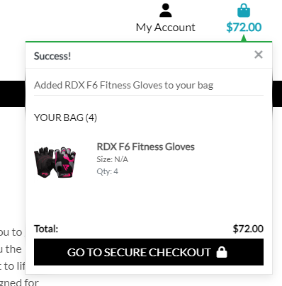

# GRIP E-SHOP

## E-commerce Store For Gym Enthusiasts
> Workout lovers e-commerce website that provides goods for sale as well as blog content to share tips and advice.

### - By Filip Svanda

## **[Live site](https://grip-e-shop-25bf5d916437.herokuapp.com/)  |  [Repository](https://github.com/RockyPraxe/GRIP)**

---

## Table of contents
<a name="contents">Back to Top</a>
 1. [ UX ](#ux)
 2. [ Business Model ](#biz)
 3. [ SEO ](#seo)
 4. [Agile Development](#agile)
 5. [ Features ](#features)  
 6. [ Features Left to Implement ](#left)  
 7. [ Technology used ](#tech) 
 8. [ Testing ](#testing)  
 9. [ Bugs ](#bugs)  
 10. [ Deployment](#deployment)
 11. [ Credits](#credits)
 12. [ Content](#content)  
 13. [ Acknowledgements](#acknowledgements)  

 ---

## UX

### Color Pallette

 Color Pallete 

 

### Database Schema

 Database Structure

 

This was the suspected preproject planning database structure. As the project was being developed changes were made to the final project due to time contraints and project scope.

---

Profiles App

 

#### Profile Model

| id | Field |
|--|--|
|user|OneToOneField|
|phone_number|CharField|
|street_address1|CharField|
|street_address2|CharField|
|town_or_city|CharField|
|county|CharField|
|postcode|CharField|
|country|CountryField|
|first_name|CharField|
|last_name|CharField|
|bio|TextField|
|profile_picture|ImageField|

---

Blog App

 

#### Post Model

| id | Field |
|--|--|
|title|CharField|
|slug|SlugField|
|excerpt|TextField|
|content|TextField|
|featured_image|ImageField|
|author|ForeignKey|
|created_on|DateTimeField|
|updated_on|DateTimeField|
|status|BooleanField|

---

Checkout App

 

#### Order Model

| id | Field |
|--|--|
|order_number|CharField|
|user_profile|ForeignKey|
|full_name|CharField|
|email|EmailField|
|phone_number|CharField|
|country|CountryField|
|postcode|CharField|
|town_or_city|CharField|
|street_address1|CharField|
|street_address2|CharField|
|county|CharField|
|date|DateTimeField|
|deliver_cost|DecimalField|
|order_total|DecimalField|
|grand_total|DecimalField|
|original_bag|TextField|
|stripe_pid|CharField|

#### OrderLineItem Model
| id | Field |
|--|--|
|order|ForeignKey|
|product|ForeignKey|
|product_size|CharField|
|quantity|IntegerField|
|lineitem_total|DecimalField|

---

Contact App

 

#### Contact Model

|id|Field|
|--|--|
|reason|CharField|
|email|EmailField|
|subject|CharField|
|message|TextField|
|submission_date|DateTimeField|

  
---

Products App

 

#### Category Model

|id|Field|
|--|--|
|name|CharField|
|label|CharField|

#### Product Model

|id|Field|
|--|--|
|category|ForeignKey|
|sku|CharField|
|name|CharField|
|description|TextField|
|has_sizes|BooleanField|
|price|DecimalField|
|rating|FloatField|
|image_url|URLField|
|image|ImageField|

## UX design

### Wireframes

 Wireframes 

 

[Back to Top of page](#contents)

---

# Business Model

#### Business Overview

The business is a B2C e-commerce platform whose goal is to provide tangible products to it's customers through an online store.

The types of products would be relatively low cost gym gloves and sport products with low (15$) to medium(89$) pricing.

The benefits for the business owner are:

1. Easy to scale the business as it grows
2. No need to set up a physical location
3. Can cater to customers globally
4. Can target a specific niche and try to build a brand that resonates with its target audience.
5. Relatively low cost in starting up which allows for a larger portion of the budget to be used for customer aquisition. ie Ads / marketing
6. Low price point would encourage impulse buying from customers who may be considering purchasing from the business.

The cons of this business model are:

1. Getting customers initally can be difficult due to saturation in certain industrys
2. Establishing a brand from the ground up takes time and immediate results are unlikely without a sound marketing strategy.
3. Getting customers organically takes time so the business would need to manually market the business or use paid advertising.
4. Not having a physical business can make it harder to build trust and loyalty with customers without offering discounts and offers.
5. As the price point fo the items is lower, the business would need to process a reasonable number of orders per day / week / month for the business to be viable.

Taking the pros and cons of this business, a subscription model seems to be an unlikely viable model as it requires a customer base and some form of brand loyalty.

The best approach would be to provide products on a pay as you go traditional e-commerce format. As the business grows then the implementation of a subscription model would make more sense.

---

#### Site User
User 1: The typical site user would be a male aged between 15 and 50 who has an interest in self care and is also interested in gym, crossfit, fighting, fitnes and other sports. The typical site user also wants to get the most out of life and constantly grow.

User 2: Additional site users could be partners of user 1 and may be browsing the site to purchase gifts for them.

---

####  Goals for the website
The goals for the website are:
- An easy to navigate website with clear purpose
- Provide users with products that meet their expectations
- Allow users to view and read on articles that may help or interest them.
- To provide users with insights or tips on workouts and fighting through helpful articles to build brand trust and loyalty.
- Allow users to checkout quickly and easily
- To allow users to create a profile to view past orders and update profile information

---

#### Marketing Strategy
The businesses marketing strategy going forward is:

1. Promote the store through it's facebook business page. This can be viewed in the SEO section.
2. Share the page with friends and family and ask them to like it and share the pafe to their wider circle.
3. Have a soft online launche sale to encourage early adoption and purchases from prospective clients
4. Gain subscribers through the mailchimp option on the site and then send out offers and promotions to encourage repeat business
5. Write meaningful and helpful articles / blog posts to help with SEO ranking in search engines like google.
6. Potentially use paid advertisement like google ads, facebook ads to promote to our target demographic.
7. Set up multiple ads with a different product as the cover image, track the click through rate and stick with the high peformers.
8. Depending on budget the business may look at promoting it's custom made products to influencers in the brands niche, offering complimentary goods or a small fee for a shout out  or review. Ideally targetting low to medium influencers with a following of at least 10k in target niche. This would be realistic with a low budget for the business starting off and can start pushing traffic towards the site. 

[Back to Top of page](#contents)

---

# SEO

### SEO Project planning

Once the business model was decided on as an GYM GLOVES store I started working on how to market the site and what keywords to target.
I utilised google trends to find more popular search terms and also used a tool called SEO quake to compare the competition and see what they are doing well.
I checked for a number of keywords on wordtracker.com and signed up for a trial to get as much out of it as possible. From there I developed a list of short tail and long tail keywords I intended to use in this project.

### Keywords

gym gloves, workout gloves, best gym gloves, mma gloves, boxing gloves, crossfit gloves, fitness gloves, training gloves, weightlifting gloves, men's gym gloves, women's gym gloves, sparing gloves, premium workout gloves, golf swing gloves

I make use of the <strong>Strong</strong> tag where necessary and ensure all links are described correctly.

### Sitemap.xml
I generated a sitemap for the site so that once ready engines like google can search it effectively.

### Robots.txt
I generated a robots.txt file so that google could crawl the site. I have blocked off the accounts app as there is no benefit for google to crawl those pages.

### Logo
Logo for facebook and web page was created with AI tool Leonardo.

I created a custom logo in Leonardo. This logo was created using the basic commands together with the use of keywords.

### Facebook Business Page

To view the facebook business page you can click on the link below:

[Facebook Business Page](https://www.facebook.com/profile.php?id=61555501545729)

In case the page becomes inactive or deactivated by Facebook I have taken screenshots to display here also:

  
Facebook Business Page Screenshots

   

[Back to Top of page](#contents)

---

## Agile Development

### Agile Overview
Once I had an initial idea of the website I was going to build I started the preplanning by creating a github projects page to track the epics, user stories and tasks required to work through for this project.

It gave me an idea of how long this project was expected to take and how to manage my workload effectively.

As I worked through the workload I moved tasks from not started to in progress to completed once the task was done. Occasionally I would find other work that were either new tasks or subtasks that required attention before completing a larger task.

### Github Project Board
To see the final project board for GRIP E-SHOP you can click the link below:
[GRIP Project Board](https://github.com/users/RockyPraxe/projects/9)

#### Epics

 1. [Epic: Registration and User Accounts](https://github.com/RockyPraxe/GRIP/issues/25)
 2. [Epic: Purchasing and Checkout](https://github.com/RockyPraxe/GRIP/issues/27)
 3. [Epic: Viewing and Navigation](https://github.com/RockyPraxe/GRIP/issues/24)
 4. [Epic: Admin and Store Management](https://github.com/RockyPraxe/GRIP/issues/28)
 5. [Epic: Sorting and Searching](https://github.com/RockyPraxe/GRIP/issues/26)

Each Epic may have 4 or more user stories associated and each user story may have tasks.

The full breakdown of user stories and tasks are included on the project board above.

These were user stories and epics that were planned at the beginning and according to them the project was completed. After the completion of the project and the implementation of all user stories and epics and subsequent communication with the mentor and tutor, a blog and a feedback form were added to the project. This is not found in user stories or epics.

[Back to Top of page](#contents)

---

## Features

 Navigation 

 

The Desktop navigation was based on Boutique Ado and seemed like a concise and clear option for an e-commerce store. 

Mobile Navigation
  

  
When developing this application I decided I wanted to add a detailed footer as would be found on most e-commerce websites.

 Authentication 

 

The authentication flows come from Allauth and have been styled to fit the theme of my website. At present when a user signs up a confirmation email is sent to their email address to confirm it before being able to access their account.

 Products Page 

 

The products page is responsive to allow equal spacing between products regardless of screen width.

  

The product detail page was intended to include a reviews option for logged in users who also purchased the specific product.

 Bag & Checkout Flow 

 

  
Once the customer makes a successful paymeent they are redirected to the payment success page where they see a summary of their order. 

 Account Profiles 

 

The account profiles app was designed to make it easy for customers to carry out some basic post order options. 
The facility to update their account information, change their shipping address or profile photo or bio.

We allow users to add and update their profile image.
This was intended to create some form of personalisation.

The customer can visit their order confirmation by clicking on the order number in the order history page. Once directed to this page they will be notified by a pop up message that this is displaying a previous order and not a new one.
  
The customer can return to the profile by clicking on the button below the order form.

 Blog 

 

The idea behind blogs was to firstly create informative and helpful articles to boost SEO and also to create a place for users to ask questions, share insights and converse with like minded people.  

  
The initial blog articles although basic are the start of what will be expanded on. At present users can read blogs articles. The future features will be added below.

 Contact Page 

 

  
The contact form was designed to be a model that sends the message to the backend of the website. In the future I will enable email notifications to the business email address and filter them depending on contact reason. For example if the query selected is complaint then the email will be forwarded to the complaints email address the ensure swift response from the correct employee of the business.

 Account Notifications 

 

When a user signs in or out they see a notification like the below to indicate this with the relevant action just taken.

When the user has placed a successful order

When a user adds an item to bag they see the below notification.
  

 Admin related permissions 

 

When the superuser logs into the account they have additional front end permissions to edit, delete and add products to the website.
The edit option and delete options are available on the products page and the add product option is on the product management page on the my account dropdown.

 Additional Pages 

 

To ensure the page reflects that of a genuine e-commerce page I wanted to include contact page and FAQ's to ensure customers common queries are available.
  

  
I have included a subscribe option for customer to provide their emails to be added to mailing lists for offers tips and tricks. This service is provided by mailchimp.
  
Initially I was considering creating a subscribe model and attaching it to the userprofile model so they can subscribe and unsub at their leisure but due to time constrainst i decided to go with mailchimp.

#### Account restrictions:

When an unverified or not logged in user trys to access the accounts section of the site they are notified they do not have permissions and then redirected back to home.

For the short term and to prevent spam, when a non logged in user trys to access the contact form page they are advised to login and redirected back to the home page. This was a personal choice and by design but in the next iteration I would add a "honey pot" type input that is hidden from the front end user. If this option is checked then it would be prevented from being submitted as it would show signs of spam / bot activity.

[Back to Top of page](#contents)

---